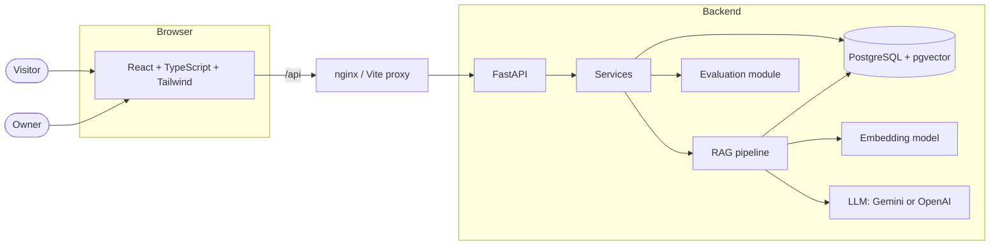

# PortfolioAI

An AI-powered portfolio you can ask questions. Visitors chat with an assistant that answers from the
owner's projects, skills, experience and documents, and shows the sources behind every answer. The same
knowledge base powers a job-description analyzer and a RAG evaluation dashboard.

> **Build status: Phase 2 of 14 complete (database schema and migrations).**
> The roadmap below shows what exists today and what each upcoming phase adds. Sections of this README
> marked *(planned)* describe the finished system.

## Roadmap

| Phase | Scope | Status |
| ----- | ----- | ------ |
| 1 | Project foundation: monorepo, FastAPI app, config, error handling, DB session, migrations tooling, React app shell, Docker | **Done** |
| 2 | Database schema and migrations: 18 tables, pgvector, initial Alembic migration, tests on SQLite and PostgreSQL | **Done** |
| 3 | Authentication (register, login, JWT, protected routes) | Next |
| 4 | Portfolio API and sample data | |
| 5 | Portfolio pages and admin management | |
| 6 | Document upload and processing | |
| 7 | RAG pipeline (dense, BM25, hybrid, reranking) | |
| 8 | Chat interface with citations | |
| 9 | Job and resume analyzers | |
| 10 | RAG evaluation and failure analysis | |
| 11 | Dashboard and charts | |
| 12 | Test hardening | |
| 13 | Docker and deployment | |
| 14 | Final README and documentation | |

## Architecture



*(RAG, evaluation and most services arrive in later phases; see [docs/architecture.md](docs/architecture.md)
for the layering rules that are already in place.)*

## Tech stack

| Layer | Technology |
| ----- | ---------- |
| Frontend | React 19, TypeScript, Vite, Tailwind CSS 4, shadcn/ui-style components, Lucide icons, React Router, TanStack Query |
| Backend | Python 3.12, FastAPI, Pydantic v2, SQLAlchemy 2, Alembic |
| Database | PostgreSQL 16 with pgvector (SQLite for fast tests) |
| AI *(planned)* | LangChain, Sentence Transformers, Gemini or OpenAI (configurable), BM25, cross-encoder reranking |
| Testing | pytest, Vitest, Testing Library |
| Infrastructure | Docker Compose, nginx |

## Getting started

### Option A: Docker (everything at once)

```bash
docker compose up --build
```

| Service | URL |
| ------- | --- |
| Web app | http://localhost:3000 |
| API docs (Swagger) | http://localhost:8000/api/docs |
| Health check | http://localhost:8000/api/health |

No configuration is required for local use. To change settings, copy `.env.example` to `.env`.

### Option B: run each part locally (best for development)

You need Python 3.12+, Node 20+ and a PostgreSQL database. The quickest database is the one from Compose:

```bash
docker compose up -d db
```

**Backend**

```bash
cd backend
python -m venv .venv
source .venv/bin/activate          # Windows: .venv\Scripts\activate
pip install -r requirements-dev.txt
cp ../.env.example ../.env         # Windows: copy ..\.env.example ..\.env
alembic upgrade head
uvicorn app.main:app --reload
```

**Frontend** (second terminal)

```bash
cd frontend
npm install
npm run dev
```

Open http://localhost:5173. The dev server forwards `/api` requests to the backend on port 8000.

### Database commands

Run from `backend/` (the database must be running; `docker compose up -d db`):

```bash
alembic upgrade head            # create / update all tables (Docker does this automatically on start)
python -m app.database.check    # is pgvector installed? are migrations applied? rows per table
alembic check                   # fails if a model changed without a migration
```

Schema, relationships and design decisions: [docs/database.md](docs/database.md).

### Running the tests

```bash
cd backend && pytest          # SQLite tests always run; PostgreSQL tests run when the db container is up
cd backend && REQUIRE_POSTGRES=1 pytest   # fail (not skip) if PostgreSQL is unreachable
cd frontend && npm test
cd frontend && npm run build  # type-checks, then builds
```

With `docker compose up -d db` running, the database tests execute twice: once on SQLite and once on real
PostgreSQL with pgvector. Each PostgreSQL run uses a temporary database that is deleted afterwards, so your
development data is never touched.

## Environment variables

All settings are read from environment variables or a `.env` file. See [`.env.example`](.env.example) for the
complete, commented list. Key points:

- `JWT_SECRET` must be a random string of 32+ characters when `ENVIRONMENT=production`; the backend refuses to
  start otherwise.
- `GEMINI_API_KEY` / `OPENAI_API_KEY` are optional until the chat features arrive (phase 7). Missing keys never
  crash the app.
- No secret is ever hard-coded or sent to the browser. `/api/health` only reports *whether* a key is set.

## API

Interactive documentation is generated automatically at `/api/docs`. Available today:

| Method | Path | Description |
| ------ | ---- | ----------- |
| GET | `/api/health/live` | Liveness probe |
| GET | `/api/health` | Service, database and configuration status |

Every error, from any endpoint, uses one shape so the frontend needs a single error parser:

```json
{ "error": { "code": "not_found", "message": "Project not found", "details": null } }
```

Each response carries an `X-Request-ID` header that matches the server log line for that request.

## Project structure

```
portfolioai/
├── backend/
│   ├── app/
│   │   ├── api/            # routers and dependencies (HTTP only)
│   │   ├── core/           # settings, logging, errors, middleware
│   │   ├── database/       # engine, session, declarative base, `check` diagnostic
│   │   ├── models/         # SQLAlchemy models (18 tables)
│   │   ├── schemas/        # Pydantic request/response models
│   │   ├── services/       # business logic
│   │   ├── rag/            # RAG pipeline
│   │   └── evaluation/     # RAG evaluation
│   ├── alembic/            # database migrations (0001_initial_schema)
│   ├── tests/              # API tests + tests/database/ (schema tests)
│   └── requirements.txt
├── frontend/
│   └── src/
│       ├── components/     # ui/ (primitives), layout/, common/
│       ├── pages/          # public/ and admin/
│       ├── hooks/  services/  types/  lib/
├── data/
│   ├── sample_documents/
│   └── evaluation/
├── docker/                 # database init script
├── docs/                   # architecture.md, database.md
├── docker-compose.yml
└── .env.example
```

## Contributing

Issues and pull requests are welcome. Please run the backend and frontend test suites before opening a PR.

## License

MIT. See [LICENSE](LICENSE).
