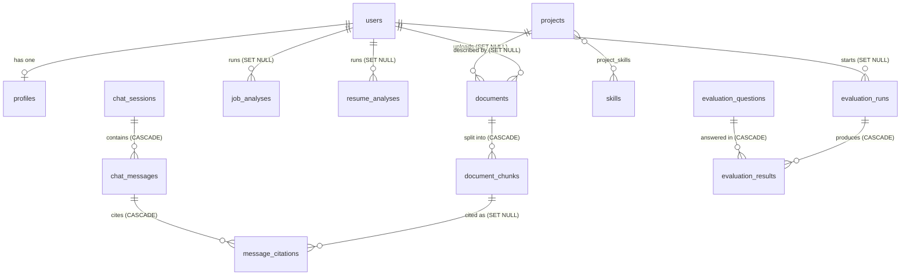

# Database design (Phase 2)

PostgreSQL 16 with the `pgvector` extension is the only database in production. 18 tables, created by one
Alembic migration (`backend/alembic/versions/0001_initial_schema.py`). The same migration also runs on SQLite,
which is what makes the fast test suite possible.

## Entity relationships



`experiences`, `education` and `certifications` are standalone lists shown on the portfolio.

## Tables by purpose

| Group | Tables | Purpose |
| ----- | ------ | ------- |
| Accounts | `users`, `profiles` | The owner logs in (Phase 3); visitors are anonymous. One profile per user. |
| Portfolio content | `skills`, `projects`, `project_skills`, `experiences`, `education`, `certifications` | The structured facts the portfolio displays. |
| Knowledge base | `documents`, `document_chunks` | Uploaded files, and the embedded text chunks RAG retrieves from. |
| Chat | `chat_sessions`, `chat_messages`, `message_citations` | Visitor conversations and the numbered source markers ([1], [2]) on each answer. |
| Analyzers | `job_analyses`, `resume_analyses` | Stored results of the job-description and resume analyzers (Phase 9). |
| Evaluation | `evaluation_questions`, `evaluation_runs`, `evaluation_results` | A question set, runs of it under different retrieval settings, and per-question metrics and failure types (Phase 10). |

## Design decisions

- **Everything searchable is a `Document`.** Text generated from a project or experience is stored as a document
  of kind `portfolio_generated`, so retrieval has one code path.
- **Embeddings live in `document_chunks.embedding`**, a `vector(384)` column (the size of
  `all-MiniLM-L6-v2`). A cosine HNSW index serves nearest-neighbour queries. `NULL` means "not embedded yet".
  Changing the embedding model to another size needs a migration and a re-embed; the dimension is the constant
  `EMBEDDING_DIM`.
- **Citations survive re-indexing.** `message_citations.chunk_id` is `SET NULL` on delete and the source title and
  snippet are copied into the row, so an old answer still shows what it cited after a document is replaced.
- **Enums are `VARCHAR` plus a `CHECK` constraint**, not PostgreSQL `ENUM` types. Adding a value is an ordinary
  migration on every database.
- **Emails and slugs are stored lowercase** and guarded by a `CHECK`, so the unique index is case-insensitive.
- **Chat session ids are UUIDs**, so a session URL cannot be guessed by counting.
- **JSON columns** are `JSONB` on PostgreSQL and plain `JSON` on SQLite. Every required JSON column has a
  database-level default (`[]` or `{}`), so raw SQL and seed scripts can omit it.
- **Every constraint is named** (see `NAMING_CONVENTION` in `database/base.py`), which keeps later migrations
  deterministic.
- **Deletes are deliberate.** Child rows that mean nothing without the parent use `CASCADE` (chunks, messages,
  results). Rows worth keeping use `SET NULL` (a document outlives the account that uploaded it).

## Working with migrations

Run from `backend/`:

```bash
alembic upgrade head                 # apply every migration
alembic downgrade base               # remove everything (development only)
alembic current                      # which revision the database is at
alembic check                        # fails if the models changed without a migration
alembic revision --autogenerate -m "add x"   # create a new migration, then read it before committing
python -m app.database.check         # pgvector installed? migrated? row counts per table
```

`python -m app.database.check` exits with status 1 when the database is unreachable or behind, so it also works as
a deployment gate.

## How the schema is tested

`backend/tests/database/` builds the schema with the real migration, not `create_all`, on a throwaway database, and
every test runs twice:

| Backend | When it runs | What it proves |
| ------- | ------------ | -------------- |
| SQLite | Always | Constraints, defaults, cascades and relationships behave as designed |
| PostgreSQL + pgvector | When a server is reachable (`docker compose up -d db`) | The same, plus the `vector(384)` column, cosine search, the HNSW index, JSONB queries |

The suite covers: migration up, down, repeat and idempotency; no drift between models and migration; every
`CHECK`, `UNIQUE` and foreign key (a test passes only if the *named* constraint rejected the row); cascade and
`SET NULL` behaviour; and vector similarity ordering.

Environment variables for the tests:

| Variable | Meaning |
| -------- | ------- |
| `TEST_POSTGRES_URL` | Admin connection used to create a temporary database. Default: the Compose database on `localhost:5432`. |
| `REQUIRE_POSTGRES=1` | Fail instead of skip when PostgreSQL is unreachable (use in CI). |
